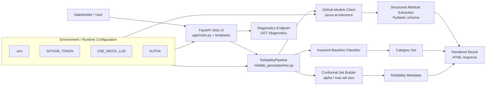

# Reliable GenAI Demo for Product Classification and Extraction

A stakeholder-facing demo project that shows how to build more trustworthy LLM pipelines for retail-style product data.

This repository demonstrates:
- A small Python reliability library (`reliable_genai`) for uncertainty-aware classification.
- An uncertainty-aware agent policy that decides when to answer, abstain, or escalate.
- Conformal Language Modeling style set prediction for controllable risk.
- Schema-validated LLM extraction with Pydantic.
- A FastAPI web interface for live demos.
- Evaluation artifacts (coverage, set size, accuracy, abstention, latency).

## Why This Project
This demo is designed to match GenAI engineering expectations around:
- Research-to-code translation (conformal calibration in production-style code).
- Benchmarking and reliability reporting.
- Practical Python engineering with clear APIs and tests.
- Uncertainty-aware behavior (calibrated set prediction + abstention).

## Uncertainty-Aware Agents and Conformal Language Modeling
This demo treats uncertainty as a product feature, not only a model byproduct.

### Uncertainty-aware agent behavior
Each prediction returns both content and reliability metadata. The agent follows a policy:
- Answer when confidence and calibration constraints are satisfied.
- Return a calibrated label set when a single high-confidence label is not justified.
- Abstain or escalate when risk exceeds configured thresholds.

### Conformal Language Modeling objective
For each input x, the system returns a set C(x) of candidate labels/responses such that:

$$
\mathbb{P}(y \in C(x)) \ge 1 - \alpha
$$

Interpretation for stakeholders:
- Smaller alpha means stricter risk control.
- Coverage is controlled statistically on future examples under calibration assumptions.
- Tradeoff: higher coverage usually increases average set size and latency.

### How CLM ideas are implemented in this demo
- Build nonconformity scores from model probabilities and consistency signals.
- Calibrate thresholds on a held-out calibration split.
- Return prediction sets instead of forced single-label outputs when uncertainty is high.
- Use abstention when set size exceeds a usability cap.

## Demo Scope
Input:
- Product title
- Product description

Output:
- Predicted category (single label or calibrated label set)
- Structured attributes (for example: brand, color, size, material)
- Reliability metadata (confidence, coverage setting, abstention reason)

## Tech Stack
- Python 3.11
- FastAPI (web app + API)
- Pydantic (schema validation)
- GitHub Models (Azure OpenAI GPT-4.1)
- NumPy / scikit-learn / MAPIE (or custom conformal utilities)
- Sentence-transformers (baseline embedding classifier)

## Architecture Overview
The demo is intentionally small: a stakeholder-facing web app calls a reliability pipeline, which combines lightweight classification, conformal-style set construction, and structured LLM extraction. The same UI also exposes diagnostics so you can verify runtime mode before a presentation.



Key runtime paths:
- The homepage renders the live badge, model name, and diagnostics panel.
- `/predict` returns the category set, extracted attributes, and reliability metadata.
- `/diagnostics` shows runtime readiness, token presence, endpoint, and last inference path.

## Data Strategy
This project uses a dataset that is compatible with the Kaufland Seller API-style CSV contract:
- Semicolon-separated CSV
- UTF-8 encoding
- Product-like fields mapped to a manageable taxonomy

Important:
- This is a demo with public or synthetic data only.
- No internal Schwarz data is required.

## Planned Repository Layout
```text
reliable_genai/
  __init__.py
  calibration.py
  scoring.py
  evaluation.py
  llm_wrappers.py
  pipeline.py
app/
  main.py
  templates/
  static/
data/
  raw/
  processed/
scripts/
  train_baseline.py
  calibrate.py
  evaluate.py
  demo_web.py
reports/
  results.md
  figures/
.env.example
README.md
```

## Getting Started
### 1) Clone and enter the project
```bash
git clone <YOUR_REPO_URL>
cd <YOUR_REPO_DIR>
```

### 2) Create and activate a virtual environment
```bash
python3.11 -m venv .venv
source .venv/bin/activate
```

### 3) Install dependencies
```bash
pip install -r requirements.txt
```

### 4) Configure environment variables
Create `.env` from `.env.example` and set:
- `GITHUB_MODELS_ENDPOINT`
- `GITHUB_TOKEN`
- `GITHUB_MODELS_MODEL`

Example values:
```env
GITHUB_MODELS_ENDPOINT=https://models.github.ai/inference
GITHUB_TOKEN=your_token_here
GITHUB_MODELS_MODEL=openai/gpt-4.1
```

### 5) Run the demo web app
```bash
uvicorn app.main:app --reload
```

Open:
- http://127.0.0.1:8000

## Configuration
Key runtime settings (to be implemented in config module or env vars):
- `ALPHA`: Target conformal risk (for example `0.1` for 90% coverage target)
- `MAX_SET_SIZE`: Upper bound on label set size before abstention
- `LLM_MAX_RETRIES`: Retry count for schema-invalid LLM outputs
- `ENABLE_ABSTAIN`: Enable abstention policy for low-confidence predictions
- `NONCONFORMITY_MODE`: Strategy for nonconformity score (probability, margin, hybrid)
- `ESCALATION_POLICY`: Action when risk is high (abstain, fallback, human_review)

## Pipeline Overview
1. Ingest and normalize product input.
2. Run baseline classifier to obtain class probabilities.
3. Generate candidate labels and compute nonconformity scores.
4. Apply conformal calibration to produce a prediction set with coverage target.
5. Run LLM-based attribute extraction.
6. Validate extraction output using Pydantic schema.
7. Apply uncertainty-aware policy (answer, set-output, abstain, or escalate).
8. Return prediction, attributes, and reliability metadata.

## Evaluation
The evaluation report should include:
- Coverage
- Average set size
- Top-1 / top-set accuracy
- Abstention rate
- End-to-end latency
- Selective risk (error rate on non-abstained predictions)
- Calibration drift checks across data slices (optional)

Suggested command skeletons:
```bash
python scripts/train_baseline.py
python scripts/calibrate.py
python scripts/evaluate.py
```

## API Skeleton (Planned)
### `POST /predict`
Request:
```json
{
  "title": "Men's running shoes",
  "description": "Breathable mesh upper with cushioned sole"
}
```

Response:
```json
{
  "category_set": ["Sports Shoes", "Running Shoes"],
  "attributes": {
    "brand": "unknown",
    "color": "black",
    "material": "mesh"
  },
  "reliability": {
    "alpha": 0.1,
    "coverage_target": 0.9,
    "set_size": 2,
    "confidence": 0.83,
    "abstained": false,
    "reason": null,
    "policy_action": "set_output",
    "llm_runtime": "LIVE",
    "llm_model": "openai/gpt-4.1"
  }
}
```

### `GET /diagnostics`
Returns runtime diagnostics for demo readiness checks.

Example response:
```json
{
  "status": "ok",
  "runtime_mode": "LIVE",
  "model": "openai/gpt-4.1",
  "endpoint": "https://models.github.ai/inference",
  "token_present": true,
  "token_prefix": "github_p...",
  "last_runtime": "LIVE"
}
```

## Demo Script (3 to 5 minutes)
1. Enter a sample product in the web UI.
2. Show baseline output.
3. Show calibrated category set and explain uncertainty.
4. Show validated attribute extraction.
5. Show one failure mode and abstention behavior.
6. Close with evaluation snapshot and coverage-vs-efficiency tradeoffs.

## Risks and Mitigations
- Label noise in public data:
  - Use a cleaned subset and document mapping assumptions.
- LLM output instability:
  - Strict Pydantic validation plus bounded retries.
- Calibration mismatch:
  - Verify on held-out calibration split and tune alpha.
- Demo complexity creep:
  - Prioritize a single clear flow over extra features.

## Roadmap
- Add richer schema coverage for additional product attributes.
- Add second-pass reviewer (optional graph-based flow).
- Add simple dashboard for reliability metrics over time.

## Contribution Notes
- Keep modules small and testable.
- Prefer deterministic preprocessing and explicit config.
- Document every reliability-related tradeoff in code comments or reports.

## License
TBD

## Contact
Parvez Zamil
- LinkedIn: https://linkedin.com/in/parvez-zamil
- GitHub: https://github.com/zparvez2z
