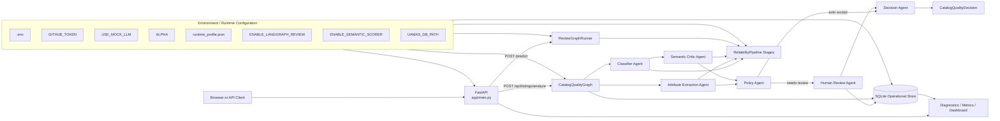

# Technical Deep Dive: Reliable GenAI Demo

This document is the implementation companion to the main [README.md](README.md). It describes the code structure, request flow, runtime behavior, and reliability controls used in the project.

## 1) System Goals
The codebase implements a small but complete GenAI pipeline for product classification and structured extraction. The engineering goals are:
- produce a bounded prediction set instead of a forced single label when uncertainty is high,
- validate structured output with Pydantic before rendering it to the UI,
- expose runtime diagnostics for live and demo verification,
- and keep the integration layer simple enough to review quickly.

## 2) Core Concepts
### Uncertainty-aware behavior
The pipeline does not force every input into a single hard answer. Instead, it can:
- return a calibrated label set,
- abstain when confidence is low,
- or fall back to deterministic behavior when the LLM path is unavailable.

### Conformal Language Modeling idea
The demo uses conformal-style set construction as the main reliability concept. For an input $x$, the system returns a set $C(x)$ of candidate labels such that the selected label is covered with controlled risk under calibration assumptions.

The practical effect is a tradeoff:
- tighter risk control increases set size,
- and larger sets can increase latency or reduce usability.

### Structured extraction
The attribute extraction path uses GitHub Models via Azure AI Inference and validates the output with Pydantic. If the model output is malformed or the call fails, the pipeline falls back to the deterministic extractor in `GitHubModelsClient`.

## 3) Architecture


### Runtime components
- `app/main.py` provides the web UI and endpoints.
- `reliable_genai/catalog_quality_graph.py` coordinates specialist agents, conditional human-review routing, persistence, and final decision assembly.
- `reliable_genai/agents/` contains the independently testable catalog agent implementations.
- `reliable_genai/review_graph.py` optionally orchestrates second-pass review through LangGraph when enabled.
- `reliable_genai/pipeline.py` exposes reusable classification, extraction, semantic-scoring, and response-assembly stages while preserving `predict()`.
- `reliable_genai/llm_wrappers.py` handles GitHub Models access, mock mode, and fallback extraction.
- `reliable_genai/persistence.py` owns SQLite schema and repository operations for listings, predictions, review tasks, workflow runs, and agent runs.
- `reliable_genai/workflow_history.py` records bounded per-agent summaries, durations, degradation, and failures.
- `reliable_genai/runtime_profile.py` resolves classifier-critical runtime defaults and precedence.
- `reliable_genai/models.py` defines the Pydantic request and response models.

## 4) Request Flow
1. The browser submits a product title and description to `POST /predict`.
2. `ReliabilityPipeline.predict()` creates a category score vector from a embedding-first (hashing+SVD) + logistic regression classifier trained on the processed training split. If scikit-learn or data files are unavailable, it falls back to the keyword scorer.
3. The set builder keeps labels until cumulative probability crosses the calibrated cumulative-mass threshold computed on the calibration split.
4. `SemanticConsistencyScorer` computes an embedding-based consistency score and status (`ok`, `degraded`, or `disabled`).
5. Optional review mode (`ENABLE_LANGGRAPH_REVIEW=true`) can run a second prediction pass for abstained/low-confidence/low-semantic-consistency outputs and keeps the stronger result.
6. `GitHubModelsClient.extract_attributes()` calls the model or falls back to a deterministic extractor.
7. The response is validated through the Pydantic models in `reliable_genai/models.py`.
8. The FastAPI route serializes the full response for the template.
9. `GET /diagnostics` reports runtime mode, endpoint, token presence, review/semantic health fields, and SQLite persistence health.

### Catalog review API flow
1. A caller submits title/description to `POST /api/listings/analyze`.
2. The store creates the listing and a durable `running` workflow before provider or model work begins.
3. `CatalogQualityGraph` starts classifier and attribute-extraction agents as independent branches; each execution is timed and persisted.
4. The semantic critic evaluates the classifier candidate set while extraction completes independently.
5. The pipeline assembles one `PredictionResponse`; the optional `ReviewGraphRunner` gate inspects that precomputed first pass without duplicating it.
6. The selected prediction is persisted and transactionally linked to the workflow.
7. The deterministic policy agent maps reliability evidence to `auto_accept` or `needs_human_review`.
8. When review is needed, the human-review agent transactionally creates and links a `pending` task.
9. The decision agent returns `CatalogQualityDecision` with its `workflow_run_id`; the workflow is then marked completed.
10. Escaping agent errors mark both the agent run and workflow failed before the error propagates.
11. Reviewers inspect and resolve tasks through the JSON API or `/review`; history and metrics remain queryable after restart.

## 5) Files and Responsibilities
### `app/main.py`
- Serves the homepage.
- Handles `POST /predict`.
- Exposes `GET /health`, `GET /diagnostics`, and `GET /dashboard`.
- Exposes `GET /review` and `POST /review/{task_id}/decision` for the browser review queue.
- Exposes catalog review JSON endpoints:
  - `POST /api/listings/analyze`
  - `GET /api/review-queue`
  - `GET /api/review-queue/{task_id}`
  - `POST /api/review-queue/{task_id}/decision`
  - `GET /api/metrics`
  - `GET /api/workflow-runs`
  - `GET /api/workflow-runs/{run_id}`
  - `GET /api/workflow-runs/{run_id}/agents`
- Passes runtime metadata and diagnostics into the Jinja template context.
- Initializes the SQLite operational store and durable catalog graph.

### `reliable_genai/pipeline.py`
- Creates the category prediction through the calibrated classifier or keyword fallback.
- Applies the set-building logic.
- Applies the abstention policy when the set is too large.
- Calls the LLM wrapper.
- Returns the final response object.

### `reliable_genai/classifier.py`
- Trains a embedding-first (hashing+SVD) + logistic regression classifier from `data/processed/train.json`.
- Loads `artifacts/classifier.joblib` when a compatible artifact is present.
- Validates artifact metadata (row counts and dataset hashes) in strict mode by default before loading.
- Enforces artifact contract fields (`artifact_format_version`, `classifier_family`, `model_type`, `sklearn_version`, `dataset_fingerprint_sha256`) before accepting artifact runtime.
- Applies deterministic mismatch policy: `auto_rebuild` (default), `fail_fast`, or `in_memory`.
- Can persist a freshly trained classifier artifact for repeatable startup behavior.
- Returns class probabilities for prediction-set construction.
- Falls back cleanly when optional classifier dependencies or data are missing.

### `reliable_genai/runtime_profile.py`
- Loads classifier-critical settings from `config/runtime_profile.json` (or `RUNTIME_PROFILE_PATH`).
- Normalizes and validates `alpha`, `classifier_model_type`, `strict_artifact_metadata`, and `classifier_artifact_mismatch_policy`.
- Provides one shared precedence chain across entrypoints:
  - CLI args > explicit env vars > profile file > hardcoded defaults.

### `scripts/train_classifier.py`
- Rebuilds the classifier artifact from train and calibration splits.
- Accepts `--model-type` to train either `embedding` (default) or `tfidf`.
- Writes `artifacts/classifier.joblib` and a readable `artifacts/calibration.json` summary.
- Resolves classifier-critical defaults through the runtime profile loader.

### `reliable_genai/calibration.py`
- Computes conformal cumulative-mass calibration thresholds from labeled calibration rows.
- Keeps the calibration scoring logic independent of the classifier implementation.

### `reliable_genai/scoring.py`
- Builds prediction sets from calibrated probability maps.
- Applies abstention policy decisions for oversized or empty category sets.

### `reliable_genai/evaluation.py`
- Computes coverage, selective coverage, top-1 accuracy, set size, abstention, and runtime metrics.
- Keeps report metric calculations shared and directly testable.

### `reliable_genai/llm_wrappers.py`
- Connects to GitHub Models.
- Uses Azure AI Inference.
- Supports mock mode and fallback behavior.
- Tracks the last runtime path in `last_runtime`.
- Parses JSON and validates structured output.

### `reliable_genai/models.py`
- Defines request and response schemas.
- Carries reliability metadata such as runtime mode, model name, and confidence values.
- Defines additive catalog workflow contracts such as `ListingInput`, `CatalogQualityDecision`, `ReviewTask`, `WorkflowRun`, and `AgentRun`.

### `reliable_genai/persistence.py`
- Creates the SQLite schema on startup.
- Stores submitted listings, prediction payloads, review tasks, workflow runs, and agent runs.
- Supports review task listing and approve/correct/reject state transitions.
- Uses WAL mode, bounded busy waits, and short synchronized writes for parallel agent branches.
- Aggregates workflow success, duration, degradation, and failure metrics alongside review metrics.
- Reports persistence diagnostics for the dashboard and `/diagnostics`.
- Defaults to `data/uamas.db` and supports `UAMAS_DB_PATH` override.

### `reliable_genai/workflow_history.py`
- Wraps domain-agent calls without coupling agent implementations to SQLite.
- Stores safe `AgentTrace` summaries instead of raw prompts or provider payloads.
- Records completed, degraded, skipped, and failed states with durations.
- Preserves the original exception after recording a failed agent run.

## 6) Reliability Metadata
The response includes:
- `alpha`
- `coverage_target`
- `set_size`
- `confidence`
- `abstained`
- `reason`
- `policy_action`
- `llm_runtime`
- `llm_model`
- `classifier_runtime`
- `classifier_reason`
- `classifier_artifact_path`
- `classifier_artifact_load_attempted`
- `classifier_artifact_load_status`
- `classifier_artifact_rejection_reason`
- `classifier_artifact_rebuild_attempted`
- `classifier_artifact_rebuild_status`
- `classifier_artifact_rebuild_reason`
- `semantic_consistency_score`
- `semantic_consistency_status`
- `semantic_consistency_reason`
- `coverage_threshold`

These fields make the behavior explainable during a review or demo and also support regression checks when the pipeline changes.

## 7) Diagnostics
`GET /diagnostics` returns:
- runtime mode,
- selected model,
- endpoint,
- whether a token is present,
- a masked token prefix,
- the last runtime path used by the pipeline,
- classifier runtime source (`ARTIFACT`, `TRAINED`, or `FALLBACK`),
- whether artifact loading was attempted,
- artifact load decision status (`loaded`, `rejected`, `missing`, or `disabled`),
- artifact rejection reason when strict checks reject a candidate artifact,
- artifact rebuild status and reason when auto-rebuild is active,
- classifier readiness and fallback reason,
- semantic scorer enablement/health/threshold fields,
- SQLite persistence availability, database path, listing count, review task count, and pending task count,
- classifier artifact path,
- and the active calibrated coverage threshold.

This is intended for quick pre-demo verification and for confirming whether a call hit live GitHub Models or the fallback path.

Healthy live mode indicators:
- `token_present: true`,
- endpoint and selected model are populated,
- `last_runtime` reports `LIVE` after a prediction,
- classifier runtime is `ARTIFACT` or `TRAINED` with `classifier_ready: true`.

Fallback interpretation:
- `mode` can still be `LIVE` while `last_runtime` shows a fallback path for the latest call,
- this usually indicates transient model/response issues rather than API misconfiguration,
- record fallback frequency and reason in demo run notes.

## 8) Environment Variables
Required:
- `GITHUB_MODELS_ENDPOINT`
- `GITHUB_TOKEN`
- `GITHUB_MODELS_MODEL`

Behavior flags:
- `RUNTIME_PROFILE_PATH` (default `config/runtime_profile.json`)
- `USE_MOCK_LLM`
- `ALPHA` (overrides profile `alpha`)
- `MAX_SET_SIZE`
- `LLM_MAX_RETRIES`
- `ENABLE_ABSTAIN`
- `CLASSIFIER_MODEL_TYPE` (overrides profile `classifier_model_type`)
- `STRICT_ARTIFACT_METADATA` (overrides profile `strict_artifact_metadata`)
- `CLASSIFIER_ARTIFACT_MISMATCH_POLICY` (`auto_rebuild` default; optional `fail_fast`, `in_memory`)
- `ENABLE_LANGGRAPH_REVIEW` (`false` default, enables optional second-pass review flow)
- `REVIEW_CONFIDENCE_THRESHOLD` (default `0.55`)
- `REVIEW_SET_SIZE_TRIGGER` (default `MAX_SET_SIZE`)
- `REVIEW_CACHE_TTL_SECONDS` (default `300`, TTL for review graph second-pass node cache)
- `REVIEW_GATE_STRATEGY` (`legacy` default, optional `latency_v1`)
- `REVIEW_VERY_LOW_CONFIDENCE_FLOOR` (default `0.35`, used by `latency_v1`)
- `ENABLE_SEMANTIC_SCORER` (`true` default)
- `GITHUB_MODELS_EMBEDDING_MODEL` (default `openai/text-embedding-3-small`)
- `SEMANTIC_CONSISTENCY_THRESHOLD` (default `0.4`, semantic review trigger threshold)
- `SEMANTIC_MAX_RETRIES` (default `1`)
- `UAMAS_DB_PATH` (default `data/uamas.db`, SQLite persistence path)

Classifier-critical precedence across app and scripts:
- CLI args (when available) > explicit env vars > runtime profile > hardcoded defaults.

## 9) Suggested Evaluation
The demo should be evaluated on:
- coverage,
- average set size,
- abstention rate,
- selective risk,
- end-to-end latency,
- and stability across easy versus ambiguous inputs.

A good demo shows both:
- a clean, high-confidence example,
- and a case where the uncertainty policy becomes visible.

For implementation work, the most useful checks are:
- `compileall` on the app and package modules,
- `scripts/train_classifier.py --force` to rebuild the classifier artifact,
- `scripts/evaluate.py` with mock LLM mode for deterministic labeled coverage and set-size metrics,
- `scripts/evaluate.py --include-runtime --output /tmp/uamas-results.md` when timing measurements are needed,
- a live `POST /predict` request with `USE_MOCK_LLM=false`,
- and a `GET /diagnostics` request before the demo starts.

## 10) Planned Repository Structure
```text
reliable_genai/
  __init__.py
  calibration.py
  scoring.py
  evaluation.py
  llm_wrappers.py
  pipeline.py
  persistence.py
app/
  main.py
  templates/
  static/
scripts/
  train_baseline.py
  calibrate.py
  evaluate.py
  demo_web.py
reports/
  results.md
```

## 11) Public Data Assumptions
The project now uses processed public Shopify product catalogue data for training/evaluation. Large raw/cache data is intentionally not committed. The ingestion path records source provenance and category distribution in `data/processed/dataset_metadata.json`.

## 12) Next Technical Enhancements
Possible next steps if the project is extended:
- add richer embedding backends (for example sentence-transformers) behind the current embedding-first interface,
- version and compare trained model artifacts across classifier families with explicit metadata,
- add a small evaluation notebook or report,
- and add a results dashboard for coverage and abstention metrics.

## 13) Pre-demo Live Validation Checklist
1. Export or set live environment variables (`GITHUB_MODELS_ENDPOINT`, `GITHUB_TOKEN`, `GITHUB_MODELS_MODEL`).
2. Start app in live mode:
   `USE_MOCK_LLM=false .venv/bin/python -m uvicorn app.main:app --reload`
3. Check diagnostics:
   `curl -s http://127.0.0.1:8000/diagnostics | python -m json.tool`
4. Run at least one clear and one ambiguous prediction.
5. Confirm response `reliability.llm_runtime` and diagnostics `last_runtime` match expected live behavior.
6. If fallback appears, capture `llm_last_error` in demo notes.

Host-side helper:
- `./host_side_verfication_pass.sh`
- Expected pass signal: each `PREDICT_*` line reports `llm_runtime: LIVE` and `diag_llm_last_error: None`.

## 14) GitHub Actions Live Smoke Workflow
Workflow file:
- `.github/workflows/live-smoke.yml`

Trigger:
- Manual `workflow_dispatch` from Actions tab.

Required repository secret:
- `MODELS_API_KEY`

What it verifies:
- live token is present in workflow runtime,
- classifier artifact can be rebuilt,
- three sample predictions complete with `llm_runtime=LIVE`,
- diagnostics remain `last_runtime=LIVE` and `llm_last_error=None`.

Local equivalent:
- `USE_MOCK_LLM=false .venv/bin/python scripts/live_smoke.py`

## 15) Merge Safety Checklist
- Keep each PR single-purpose (tests, docs, workflow, evaluation) instead of mixing concerns.
- Rebase on `main` before opening and before merging.
- Prefer append-only edits in large test files to reduce hunk conflicts.
- Use feature-scoped test names to avoid accidental duplicates.
- Avoid committing generated report artifacts unless explicitly required for evidence.
- For stacked work, split follow-up changes into small PRs with narrow file scope.
