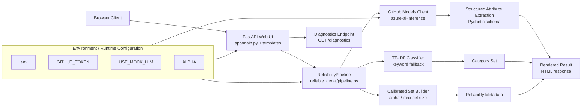

# Technical Deep Dive: Reliable GenAI Demo

This document is the implementation companion to the main [README.md](README.md). It describes the code structure, request flow, runtime behavior, and reliability controls used in the project.

## 1) System Goals
The codebase implements a small but complete GenAI pipeline for product classification and structured extraction. The engineering goals are:
- produce a bounded prediction set instead of a forced single label when uncertainty is high,
- validate structured output with Pydantic before rendering it to the UI,
- expose runtime diagnostics for live and demo verification,
- and keep the integration layer simple enough to review quickly.

## 2) Core Concepts
### Uncertainty-aware behavior
The pipeline does not force every input into a single hard answer. Instead, it can:
- return a calibrated label set,
- abstain when confidence is low,
- or fall back to deterministic behavior when the LLM path is unavailable.

### Conformal Language Modeling idea
The demo uses conformal-style set construction as the main reliability concept. For an input $x$, the system returns a set $C(x)$ of candidate labels such that the selected label is covered with controlled risk under calibration assumptions.

The practical effect is a tradeoff:
- tighter risk control increases set size,
- and larger sets can increase latency or reduce usability.

### Structured extraction
The attribute extraction path uses GitHub Models via Azure AI Inference and validates the output with Pydantic. If the model output is malformed or the call fails, the pipeline falls back to the deterministic extractor in `GitHubModelsClient`.

## 3) Architecture


### Runtime components
- `app/main.py` provides the web UI and endpoints.
- `reliable_genai/pipeline.py` implements the classification, set construction, and response assembly logic.
- `reliable_genai/llm_wrappers.py` handles GitHub Models access, mock mode, and fallback extraction.
- `reliable_genai/models.py` defines the Pydantic request and response models.

## 4) Request Flow
1. The browser submits a product title and description to `POST /predict`.
2. `ReliabilityPipeline.predict()` creates a category score vector from a embedding-first (hashing+SVD) + logistic regression classifier trained on the processed training split. If scikit-learn or data files are unavailable, it falls back to the keyword scorer.
3. The set builder keeps labels until cumulative probability crosses the calibrated cumulative-mass threshold computed on the calibration split.
4. `GitHubModelsClient.extract_attributes()` calls the model or falls back to a deterministic extractor.
5. The response is validated through the Pydantic models in `reliable_genai/models.py`.
6. The FastAPI route serializes the full response for the template.
7. `GET /diagnostics` reports runtime mode, endpoint, token presence, and the last inference path.

## 5) Files and Responsibilities
### `app/main.py`
- Serves the homepage.
- Handles `POST /predict`.
- Exposes `GET /health` and `GET /diagnostics`.
- Passes runtime metadata and diagnostics into the Jinja template context.

### `reliable_genai/pipeline.py`
- Creates the category prediction through the calibrated classifier or keyword fallback.
- Applies the set-building logic.
- Applies the abstention policy when the set is too large.
- Calls the LLM wrapper.
- Returns the final response object.

### `reliable_genai/classifier.py`
- Trains a embedding-first (hashing+SVD) + logistic regression classifier from `data/processed/train.json`.
- Loads `artifacts/classifier.joblib` when a compatible artifact is present.
- Validates artifact metadata (row counts and dataset hashes) in strict mode by default before loading.
- Enforces artifact contract fields (`artifact_format_version`, `classifier_family`, `model_type`, `sklearn_version`, `dataset_fingerprint_sha256`) before accepting artifact runtime.
- Can persist a freshly trained classifier artifact for repeatable startup behavior.
- Returns class probabilities for prediction-set construction.
- Falls back cleanly when optional classifier dependencies or data are missing.

### `scripts/train_classifier.py`
- Rebuilds the classifier artifact from train and calibration splits.
- Accepts `--model-type` to train either `embedding` (default) or `tfidf`.
- Writes `artifacts/classifier.joblib` and a readable `artifacts/calibration.json` summary.

### `reliable_genai/calibration.py`
- Computes conformal cumulative-mass calibration thresholds from labeled calibration rows.
- Keeps the calibration scoring logic independent of the classifier implementation.

### `reliable_genai/scoring.py`
- Builds prediction sets from calibrated probability maps.
- Applies abstention policy decisions for oversized or empty category sets.

### `reliable_genai/evaluation.py`
- Computes coverage, selective coverage, top-1 accuracy, set size, abstention, and runtime metrics.
- Keeps report metric calculations shared and directly testable.

### `reliable_genai/llm_wrappers.py`
- Connects to GitHub Models.
- Uses Azure AI Inference.
- Supports mock mode and fallback behavior.
- Tracks the last runtime path in `last_runtime`.
- Parses JSON and validates structured output.

### `reliable_genai/models.py`
- Defines request and response schemas.
- Carries reliability metadata such as runtime mode, model name, and confidence values.

## 6) Reliability Metadata
The response includes:
- `alpha`
- `coverage_target`
- `set_size`
- `confidence`
- `abstained`
- `reason`
- `policy_action`
- `llm_runtime`
- `llm_model`
- `classifier_runtime`
- `classifier_reason`
- `classifier_artifact_path`
- `coverage_threshold`

These fields make the behavior explainable during a review or demo and also support regression checks when the pipeline changes.

## 7) Diagnostics
`GET /diagnostics` returns:
- runtime mode,
- selected model,
- endpoint,
- whether a token is present,
- a masked token prefix,
- the last runtime path used by the pipeline,
- classifier runtime source (`ARTIFACT`, `TRAINED`, or `FALLBACK`),
- whether artifact loading was attempted,
- artifact load decision status (`loaded`, `rejected`, `missing`, or `disabled`),
- artifact rejection reason when strict checks reject a candidate artifact,
- classifier readiness and fallback reason,
- classifier artifact path,
- and the active calibrated coverage threshold.

This is intended for quick pre-demo verification and for confirming whether a call hit live GitHub Models or the fallback path.

Healthy live mode indicators:
- `token_present: true`,
- endpoint and selected model are populated,
- `last_runtime` reports `LIVE` after a prediction,
- classifier runtime is `ARTIFACT` or `TRAINED` with `classifier_ready: true`.

Fallback interpretation:
- `mode` can still be `LIVE` while `last_runtime` shows a fallback path for the latest call,
- this usually indicates transient model/response issues rather than API misconfiguration,
- record fallback frequency and reason in demo run notes.

## 8) Environment Variables
Required:
- `GITHUB_MODELS_ENDPOINT`
- `GITHUB_TOKEN`
- `GITHUB_MODELS_MODEL`

Behavior flags:
- `USE_MOCK_LLM`
- `ALPHA` (default `0.1`; also drives default `scripts/train_classifier.py` alpha when `--alpha` is omitted)
- `MAX_SET_SIZE`
- `LLM_MAX_RETRIES`
- `ENABLE_ABSTAIN`
- `CLASSIFIER_MODEL_TYPE` (`embedding` default, `tfidf` optional)
- `STRICT_ARTIFACT_METADATA` (`true` default, set to `false` only for temporary compatibility fallback)

## 9) Suggested Evaluation
The demo should be evaluated on:
- coverage,
- average set size,
- abstention rate,
- selective risk,
- end-to-end latency,
- and stability across easy versus ambiguous inputs.

A good demo shows both:
- a clean, high-confidence example,
- and a case where the uncertainty policy becomes visible.

For implementation work, the most useful checks are:
- `compileall` on the app and package modules,
- `scripts/train_classifier.py --force` to rebuild the classifier artifact,
- `scripts/evaluate.py` with mock LLM mode for deterministic labeled coverage and set-size metrics,
- `scripts/evaluate.py --include-runtime --output /tmp/uamas-results.md` when timing measurements are needed,
- a live `POST /predict` request with `USE_MOCK_LLM=false`,
- and a `GET /diagnostics` request before the demo starts.

## 10) Planned Repository Structure
```text
reliable_genai/
  __init__.py
  calibration.py
  scoring.py
  evaluation.py
  llm_wrappers.py
  pipeline.py
app/
  main.py
  templates/
  static/
scripts/
  train_baseline.py
  calibrate.py
  evaluate.py
  demo_web.py
reports/
  results.md
```

## 11) Public Data Assumptions
The project is intended to work with public or synthetic product data. The CSV contract is modeled after the Kaufland Seller API format, but the demo does not require private data.

## 12) Next Technical Enhancements
Possible next steps if the project is extended:
- add richer embedding backends (for example sentence-transformers) behind the current embedding-first interface,
- version and compare trained model artifacts across classifier families with explicit metadata,
- add a small evaluation notebook or report,
- and add a results dashboard for coverage and abstention metrics.
