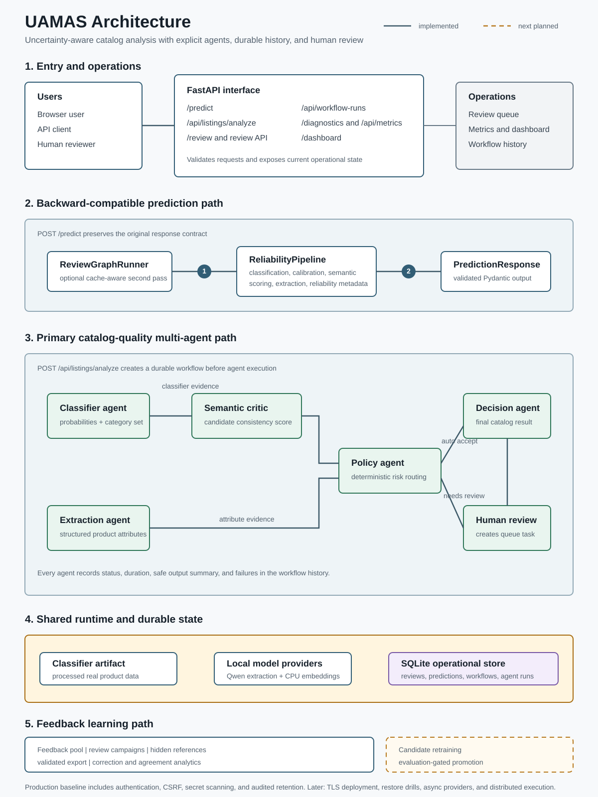

# Technical Deep Dive: UAMAS

This document is the implementation companion to the main [README.md](README.md). It describes the current UAMAS architecture, request flows, runtime behavior, reliability controls, operational boundaries, and proposed engineering work.

## 1) System Goals
UAMAS stands for **Uncertainty-Aware Multi-Agent System**. Its current product use case is catalog-quality analysis: classify a product, extract structured attributes, challenge the result semantically, route uncertain cases to a person, and preserve the evidence behind every decision.

The engineering goals are:
- produce a bounded prediction set instead of a forced single label when uncertainty is high,
- coordinate explicit specialist agents with deterministic routing,
- validate structured output with Pydantic before rendering it to the UI,
- preserve workflow and per-agent execution history,
- use human review as future training evidence,
- expose runtime diagnostics for operational verification,
- and remain usable when optional model services degrade.

## 2) Core Concepts
### Uncertainty-aware behavior
The pipeline does not force every input into a single hard answer. Instead, it can:
- return a calibrated label set,
- abstain when confidence is low,
- or fall back to deterministic behavior when the LLM path is unavailable.

### Conformal Language Modeling idea
The demo uses conformal-style set construction as the main reliability concept. For an input $x$, the system returns a set $C(x)$ of candidate labels such that the selected label is covered with controlled risk under calibration assumptions.

The practical effect is a tradeoff:
- tighter risk control increases set size,
- and larger sets can increase latency or reduce usability.

### Structured extraction
The attribute extraction path uses GitHub Models via Azure AI Inference and validates the output with Pydantic. If the model output is malformed or the call fails, the pipeline falls back to the deterministic extractor in `GitHubModelsClient`.

## 3) Architecture


How to read the diagram:
- The upper lane is the backward-compatible `/predict` path.
- The central lane is the primary operational path and contains the explicit catalog-quality agents.
- Shared model, artifact, and SQLite services support both request paths.
- The operations column exposes review, diagnostics, metrics, dashboard, and durable workflow history.
- Solid connections are implemented. The feedback evidence path is implemented; only candidate retraining and promotion remain dashed/planned.

### Delivery status
**Implemented now**
- Real public catalog data ingestion and deterministic train/calibration/test splits.
- A pinned classifier runtime profile and strict artifact compatibility handling.
- Calibrated prediction sets, abstention, semantic consistency scoring, and graceful provider fallback.
- Explicit classifier, extraction, semantic critic, policy, human review, and decision agents.
- SQLite-backed listings, predictions, review tasks, workflow runs, and per-agent execution history.
- Production fail-closed authentication, signed admin sessions, bearer API access, CSRF protection, security headers, and bounded request bodies.
- Audited workflow-history retention with dry-run preview, pre-change backup, bounded pruning, and optional vacuum.
- Browser and JSON review interfaces, operational metrics, diagnostics, dashboard, CI, and live smoke verification.
- A disjoint, balanced feedback pool with deterministic review campaigns, bounded execution, hidden reference labels, aggregate agreement reporting, and validated feedback export.

**Next planned**
- Resolve the first balanced review campaign.
- Train feedback-augmented artifacts as candidates without replacing the active artifact.
- Compare candidates on untouched test evidence and promote only through explicit guardrails.

**Proposed after the feedback loop**
- Deployment-specific backup restoration drills and operational monitoring.
- Async provider clients and distributed workflow execution when measured load justifies them.

### Runtime components
- `app/main.py` provides the web UI and endpoints.
- `reliable_genai/catalog_quality_graph.py` coordinates specialist agents, conditional human-review routing, persistence, and final decision assembly.
- `reliable_genai/agents/` contains the independently testable catalog agent implementations.
- `reliable_genai/review_graph.py` optionally orchestrates second-pass review through LangGraph when enabled.
- `reliable_genai/pipeline.py` exposes reusable classification, extraction, semantic-scoring, and response-assembly stages while preserving `predict()`.
- `reliable_genai/llm_wrappers.py` handles GitHub Models access, mock mode, and fallback extraction.
- `reliable_genai/persistence.py` owns SQLite schema and repository operations for listings, predictions, review tasks, workflow runs, and agent runs.
- `reliable_genai/workflow_history.py` records bounded per-agent summaries, durations, degradation, and failures.
- `reliable_genai/security.py` owns production configuration validation, admin sessions, API bearer authentication, CSRF checks, and response hardening.
- `reliable_genai/maintenance.py` owns retention policy resolution and audited cleanup orchestration.
- `reliable_genai/review_campaigns.py` owns deterministic campaign sampling, bounded execution, hidden-reference comparison, and retraining readiness reporting.
- `reliable_genai/runtime_profile.py` resolves classifier-critical runtime defaults and precedence.
- `reliable_genai/models.py` defines the Pydantic request and response models.

## 4) Request Flow
1. The browser submits a product title and description to `POST /predict`.
2. `ReliabilityPipeline.predict()` creates a category score vector from a embedding-first (hashing+SVD) + logistic regression classifier trained on the processed training split. If scikit-learn or data files are unavailable, it falls back to the keyword scorer.
3. The set builder keeps labels until cumulative probability crosses the calibrated cumulative-mass threshold computed on the calibration split.
4. `SemanticConsistencyScorer` computes an embedding-based consistency score and status (`ok`, `degraded`, or `disabled`).
5. Optional review mode (`ENABLE_LANGGRAPH_REVIEW=true`) can run a second prediction pass for abstained/low-confidence/low-semantic-consistency outputs and keeps the stronger result.
6. `GitHubModelsClient.extract_attributes()` calls the model or falls back to a deterministic extractor.
7. The response is validated through the Pydantic models in `reliable_genai/models.py`.
8. The FastAPI route serializes the full response for the template.
9. `GET /diagnostics` reports runtime mode, endpoint, token presence, review/semantic health fields, and SQLite persistence health.

### Catalog review API flow
1. A caller submits title/description to `POST /api/listings/analyze`.
2. The store creates the listing and a durable `running` workflow before provider or model work begins.
3. `CatalogQualityGraph` starts classifier and attribute-extraction agents as independent branches; each execution is timed and persisted.
4. The semantic critic evaluates the classifier candidate set while extraction completes independently.
5. The pipeline assembles one `PredictionResponse`; the optional `ReviewGraphRunner` gate inspects that precomputed first pass without duplicating it.
6. The selected prediction is persisted and transactionally linked to the workflow.
7. The deterministic policy agent maps reliability evidence to `auto_accept` or `needs_human_review`.
8. When review is needed, the human-review agent transactionally creates and links a `pending` task.
9. The decision agent returns `CatalogQualityDecision` with its `workflow_run_id`; the workflow is then marked completed.
10. Escaping agent errors mark both the agent run and workflow failed before the error propagates.
11. Reviewers inspect and resolve tasks through the JSON API or `/review`; history and metrics remain queryable after restart.

## 5) Files and Responsibilities
### `app/main.py`
- Serves the homepage.
- Handles `POST /predict`.
- Exposes `GET /health`, `GET /diagnostics`, and `GET /dashboard`.
- Exposes `GET /review` and `POST /review/{task_id}/decision` for the browser review queue.
- Exposes catalog review JSON endpoints:
  - `POST /api/listings/analyze`
  - `GET /api/review-queue`
  - `GET /api/review-queue/{task_id}`
  - `POST /api/review-queue/{task_id}/decision`
  - `GET /api/metrics`
  - `GET /api/workflow-runs`
  - `GET /api/workflow-runs/{run_id}`
  - `GET /api/workflow-runs/{run_id}/agents`
- Passes runtime metadata and diagnostics into the Jinja template context.
- Initializes the SQLite operational store and durable catalog graph.

### `reliable_genai/pipeline.py`
- Creates the category prediction through the calibrated classifier or keyword fallback.
- Applies the set-building logic.
- Applies the abstention policy when the set is too large.
- Calls the LLM wrapper.
- Returns the final response object.

### `reliable_genai/classifier.py`
- Trains a embedding-first (hashing+SVD) + logistic regression classifier from `data/processed/train.json`.
- Loads `artifacts/classifier.joblib` when a compatible artifact is present.
- Validates artifact metadata (row counts and dataset hashes) in strict mode by default before loading.
- Enforces artifact contract fields (`artifact_format_version`, `classifier_family`, `model_type`, `sklearn_version`, `dataset_fingerprint_sha256`) before accepting artifact runtime.
- Applies deterministic mismatch policy: `auto_rebuild` (default), `fail_fast`, or `in_memory`.
- Can persist a freshly trained classifier artifact for repeatable startup behavior.
- Returns class probabilities for prediction-set construction.
- Falls back cleanly when optional classifier dependencies or data are missing.

### `reliable_genai/runtime_profile.py`
- Loads classifier-critical settings from `config/runtime_profile.json` (or `RUNTIME_PROFILE_PATH`).
- Normalizes and validates `alpha`, `classifier_model_type`, `strict_artifact_metadata`, and `classifier_artifact_mismatch_policy`.
- Provides one shared precedence chain across entrypoints:
  - CLI args > explicit env vars > profile file > hardcoded defaults.

### `scripts/train_classifier.py`
- Rebuilds the classifier artifact from train and calibration splits.
- Accepts `--model-type` to train either `embedding` (default) or `tfidf`.
- Writes `artifacts/classifier.joblib` and a readable `artifacts/calibration.json` summary.
- Resolves classifier-critical defaults through the runtime profile loader.

### `reliable_genai/calibration.py`
- Computes conformal cumulative-mass calibration thresholds from labeled calibration rows.
- Keeps the calibration scoring logic independent of the classifier implementation.

### `reliable_genai/scoring.py`
- Builds prediction sets from calibrated probability maps.
- Applies abstention policy decisions for oversized or empty category sets.

### `reliable_genai/evaluation.py`
- Computes coverage, selective coverage, top-1 accuracy, set size, abstention, and runtime metrics.
- Keeps report metric calculations shared and directly testable.

### `reliable_genai/llm_wrappers.py`
- Connects to GitHub Models.
- Uses Azure AI Inference.
- Supports mock mode and fallback behavior.
- Tracks the last runtime path in `last_runtime`.
- Parses JSON and validates structured output.

### `reliable_genai/models.py`
- Defines request and response schemas.
- Carries reliability metadata such as runtime mode, model name, and confidence values.
- Defines additive catalog workflow contracts such as `ListingInput`, `CatalogQualityDecision`, `ReviewTask`, `WorkflowRun`, and `AgentRun`.

### `reliable_genai/persistence.py`
- Creates the SQLite schema on startup.
- Stores submitted listings, prediction payloads, review tasks, workflow runs, and agent runs.
- Supports review task listing and approve/correct/reject state transitions.
- Uses WAL mode, bounded busy waits, and short synchronized writes for parallel agent branches.
- Aggregates workflow success, duration, degradation, and failure metrics alongside review metrics.
- Reports persistence diagnostics for the dashboard and `/diagnostics`.
- Defaults to `data/uamas.db` and supports `UAMAS_DB_PATH` override.

### `reliable_genai/workflow_history.py`
- Wraps domain-agent calls without coupling agent implementations to SQLite.
- Stores safe `AgentTrace` summaries instead of raw prompts or provider payloads.
- Records completed, degraded, skipped, and failed states with durations.
- Preserves the original exception after recording a failed agent run.

### `reliable_genai/security.py`
- Keeps local development authentication disabled unless explicitly enabled.
- Forces authentication and validates distinct strong secrets in production.
- Signs short-lived administrator session cookies and validates bearer API tokens.
- Provides CSRF validation for browser form writes and constant-time secret comparisons.
- Applies security headers and no-store caching to sensitive responses.

### `reliable_genai/maintenance.py`
- Resolves conservative retention defaults from environment variables.
- Previews eligible workflow history without changing operational records.
- Creates a SQLite backup before applied cleanup.
- Prunes detailed agent history and workflow error text while preserving workflow summaries.
- Preserves running workflows, pending reviews, and all resolved review evidence.
- Records successful and failed attempts in `maintenance_runs`.

### `reliable_genai/feedback.py`
- Joins resolved reviews to their listing, prediction, and workflow provenance.
- Produces deterministic audit evidence and conservative training examples.
- Excludes rejected, incomplete, invalid, and ambiguous approved records from training input.
- Reports correction and rejection rates by original category and review reason.
- Writes checksummed manifests and uses deterministic batch fingerprints for idempotency.

### `scripts/cleanup_operational_data.py`
- Runs in dry-run mode unless `--apply` is supplied.
- Supports deterministic `--now`, database-path override, and optional `--vacuum`.
- Prints a structured cleanup report for operational evidence.

### `scripts/export_review_feedback.py`
- Previews resolved, not-yet-exported review evidence by default.
- Writes and registers a versioned batch only when `--apply` is supplied.
- Supports database-path and output-directory overrides.
- Keeps reviewer notes out of generated evidence and training files.

### `scripts/review_campaign.py`
- Plans and creates deterministic category-balanced campaigns from `feedback_pool.json`.
- Processes bounded batches through the normal catalog graph and resumes remaining work safely.
- Reuses naturally triggered review tasks and creates explicit controls for auto-accepted cases.
- Reports model/reviewer/reference agreement and retraining readiness without exposing per-item reference labels.

## 6) Reliability Metadata
The response includes:
- `alpha`
- `coverage_target`
- `set_size`
- `confidence`
- `abstained`
- `reason`
- `policy_action`
- `llm_runtime`
- `llm_model`
- `classifier_runtime`
- `classifier_reason`
- `classifier_artifact_path`
- `classifier_artifact_load_attempted`
- `classifier_artifact_load_status`
- `classifier_artifact_rejection_reason`
- `classifier_artifact_rebuild_attempted`
- `classifier_artifact_rebuild_status`
- `classifier_artifact_rebuild_reason`
- `semantic_consistency_score`
- `semantic_consistency_status`
- `semantic_consistency_reason`
- `coverage_threshold`

These fields make the behavior explainable during a review or demo and also support regression checks when the pipeline changes.

## 7) Diagnostics
`GET /diagnostics` returns:
- runtime mode,
- selected model,
- endpoint,
- whether a token is present,
- active security environment and whether authentication is enabled,
- the last runtime path used by the pipeline,
- classifier runtime source (`ARTIFACT`, `TRAINED`, or `FALLBACK`),
- whether artifact loading was attempted,
- artifact load decision status (`loaded`, `rejected`, `missing`, or `disabled`),
- artifact rejection reason when strict checks reject a candidate artifact,
- artifact rebuild status and reason when auto-rebuild is active,
- classifier readiness and fallback reason,
- semantic scorer enablement/health/threshold fields,
- SQLite persistence availability, database path, listing count, review task count, and pending task count,
- classifier artifact path,
- and the active calibrated coverage threshold.

The endpoint is protected whenever authentication is enabled. It does not expose token values or token prefixes.

Healthy live mode indicators:
- `token_present: true`,
- endpoint and selected model are populated,
- `last_runtime` reports `LIVE` after a prediction,
- classifier runtime is `ARTIFACT` or `TRAINED` with `classifier_ready: true`.

Fallback interpretation:
- `mode` can still be `LIVE` while `last_runtime` shows a fallback path for the latest call,
- this usually indicates transient model/response issues rather than API misconfiguration,
- record fallback frequency and reason in demo run notes.

## 8) Environment Variables
Required:
- `GITHUB_MODELS_ENDPOINT`
- `GITHUB_TOKEN`
- `GITHUB_MODELS_MODEL`

Behavior flags:
- `RUNTIME_PROFILE_PATH` (default `config/runtime_profile.json`)
- `USE_MOCK_LLM`
- `ALPHA` (overrides profile `alpha`)
- `MAX_SET_SIZE`
- `LLM_MAX_RETRIES`
- `ENABLE_ABSTAIN`
- `CLASSIFIER_MODEL_TYPE` (overrides profile `classifier_model_type`)
- `STRICT_ARTIFACT_METADATA` (overrides profile `strict_artifact_metadata`)
- `CLASSIFIER_ARTIFACT_MISMATCH_POLICY` (`auto_rebuild` default; optional `fail_fast`, `in_memory`)
- `ENABLE_LANGGRAPH_REVIEW` (`false` default, enables optional second-pass review flow)
- `REVIEW_CONFIDENCE_THRESHOLD` (default `0.55`)
- `REVIEW_SET_SIZE_TRIGGER` (default `MAX_SET_SIZE`)
- `REVIEW_CACHE_TTL_SECONDS` (default `300`, TTL for review graph second-pass node cache)
- `REVIEW_GATE_STRATEGY` (`legacy` default, optional `latency_v1`)
- `REVIEW_VERY_LOW_CONFIDENCE_FLOOR` (default `0.35`, used by `latency_v1`)
- `ENABLE_SEMANTIC_SCORER` (`true` default)
- `GITHUB_MODELS_EMBEDDING_MODEL` (default `openai/text-embedding-3-small`)
- `SEMANTIC_CONSISTENCY_THRESHOLD` (default `0.4`, semantic review trigger threshold)
- `SEMANTIC_MAX_RETRIES` (default `1`)
- `UAMAS_DB_PATH` (default `data/uamas.db`, SQLite persistence path)

Security:
- `UAMAS_ENV` (`development` default; `production` forces authentication)
- `UAMAS_AUTH_ENABLED` (optional local/test authentication switch)
- `UAMAS_ADMIN_TOKEN` (browser administrator credential)
- `UAMAS_API_TOKEN` (machine API bearer credential)
- `UAMAS_SESSION_SECRET` (administrator session-signing secret)
- `UAMAS_COOKIE_SECURE` (`true` is mandatory in production)
- `UAMAS_SESSION_TTL_SECONDS` (default `28800`)
- `UAMAS_MAX_REQUEST_BYTES` (default `1000000`)
- `UAMAS_ALLOWED_HOSTS` (comma-separated and mandatory in production)

Retention and cleanup:
- `WORKFLOW_RETENTION_DAYS` (default `90`)
- `RESOLVED_REVIEW_RETENTION_DAYS` (must remain `0` until exported-feedback restore verification is exercised)
- `CLEANUP_BATCH_SIZE` (default `500`)
- `CLEANUP_BACKUP_ENABLED` (default `true`)
- `CLEANUP_BACKUP_DIR` (default `data/backups`)

Classifier-critical precedence across app and scripts:
- CLI args (when available) > explicit env vars > runtime profile > hardcoded defaults.

## 9) Suggested Evaluation
The system should be evaluated on:
- coverage,
- average set size,
- abstention rate,
- selective risk,
- end-to-end latency,
- and stability across easy versus ambiguous inputs.

A useful validation run includes both:
- a clean, high-confidence example,
- and a case where the uncertainty policy becomes visible.

For implementation work, the most useful checks are:
- `compileall` on the app and package modules,
- `scripts/train_classifier.py --force` to rebuild the classifier artifact,
- `scripts/evaluate.py` with mock LLM mode for deterministic labeled coverage and set-size metrics,
- `scripts/evaluate.py --include-runtime --output /tmp/uamas-results.md` when timing measurements are needed,
- a live `POST /predict` request with `USE_MOCK_LLM=false`,
- and a `GET /diagnostics` request before the demo starts.

## 10) Current Repository Structure
```text
app/
  main.py
  templates/
  static/
config/
  runtime_profile.json
docs/
  architecture.svg
reliable_genai/
  __init__.py
  agents/
  calibration.py
  catalog_quality_graph.py
  classifier.py
  evaluation.py
  feedback.py
  llm_wrappers.py
  maintenance.py
  models.py
  pipeline.py
  persistence.py
  review_graph.py
  review_campaigns.py
  runtime_profile.py
  scoring.py
  security.py
  semantic_scorer.py
  workflow_history.py
scripts/
  check_secrets.py
  cleanup_operational_data.py
  evaluate.py
  export_review_feedback.py
  ingest_real_products.py
  live_smoke.py
  review_campaign.py
  train_classifier.py
reports/
  results.json
  results.md
tests/
```

## 11) Public Data Assumptions
The project uses processed public Shopify product catalogue data for training/evaluation. Large raw/cache data is intentionally not committed. The ingestion path records source provenance, split fingerprints, category distribution, and disjoint split ownership in `data/processed/dataset_metadata.json`.

The 120-row `feedback_pool.json` is removed from the untouched test split before review. Human-reviewed feedback may therefore become future training evidence without contaminating canonical evaluation.

## 12) Engineering Roadmap
### Immediate: feedback evidence
Status: **implemented for the first export slice**.

Implemented:
1. Export only resolved, not-yet-exported review tasks with original prediction, reviewer action, corrected values, review reason, and workflow id.
2. Validate records and exclude incomplete, rejected, invalid, or ambiguous approved examples from training input.
3. Report correction counts and rates by category and review reason.
4. Produce versioned JSONL evidence, training, and exclusion artifacts with a checksummed manifest.
5. Track completed batches and review-task membership in SQLite to prevent duplicate exports.
6. Keep retraining and artifact promotion manual until an evaluation comparison passes defined guardrails.

Feedback export workflow:
```bash
.venv/bin/python scripts/export_review_feedback.py
.venv/bin/python scripts/export_review_feedback.py --apply
```

The first command is a dry run. The applied command writes a private batch under `data/feedback/` and registers it only after all artifacts and the manifest are complete.

Next feedback-loop work:
- resolve the balanced campaign and evaluate its readiness report,
- combine eligible feedback with the pinned public training split as a candidate,
- compare candidate and active artifacts on fixed evaluation evidence,
- promote only when coverage and correction-rate guardrails pass.

Review campaign workflow:
```bash
USE_MOCK_LLM=true .venv/bin/python scripts/review_campaign.py \
  plan --name baseline-01 --per-category 20 --seed 42
USE_MOCK_LLM=true .venv/bin/python scripts/review_campaign.py \
  create --name baseline-01 --per-category 20 --seed 42
USE_MOCK_LLM=true .venv/bin/python scripts/review_campaign.py \
  run CAMPAIGN_ID --limit 20
.venv/bin/python scripts/review_campaign.py status CAMPAIGN_ID
.venv/bin/python scripts/review_campaign.py report CAMPAIGN_ID
```

The campaign runner preserves the model's natural policy decision. Naturally uncertain cases reuse their policy-created task; auto-accepted controls receive a separate `campaign_control` task. Reference labels are stored only in campaign persistence and are absent from review queue responses, templates, and feedback training JSONL.

### Implemented production baseline
- Production fails startup when authentication secrets or allowed hosts are missing.
- Browser operations use a signed administrator session and CSRF-protected writes.
- Machine APIs use a distinct bearer token.
- Diagnostics, metrics, review data, workflow history, and artifacts are protected.
- Cleanup is explicit, dry-run by default, audited, and backed up before pruning.
- CI scans tracked files for secrets and audits Python dependencies.

Cleanup workflow:
```bash
.venv/bin/python scripts/cleanup_operational_data.py
.venv/bin/python scripts/cleanup_operational_data.py --apply
.venv/bin/python scripts/cleanup_operational_data.py --apply --vacuum
```

The first command only previews eligible data. Applied cleanup removes detailed agent rows and clears old workflow error text while retaining workflow summaries and review evidence.

### Remaining deployment work
- Exercise backup restoration and document recovery-time expectations for the chosen host.
- Put the application behind TLS and deployment-level request throttling.
- Connect alerts to authentication failures, provider degradation, database growth, and failed maintenance runs.
- Measure database growth and query latency before introducing a larger database.

### Scale only when measurements require it
- Replace synchronous provider calls with async clients and bounded timeouts.
- Move execution to workers only when request latency or concurrency requires it.
- Evaluate richer embedding backends and classifier families through versioned artifact comparisons.

## 13) Live Runtime Validation Checklist
1. Export or set live environment variables (`GITHUB_MODELS_ENDPOINT`, `GITHUB_TOKEN`, `GITHUB_MODELS_MODEL`).
2. Start app in live mode:
   `USE_MOCK_LLM=false .venv/bin/python -m uvicorn app.main:app --reload`
3. Check diagnostics:
   `curl -s http://127.0.0.1:8000/diagnostics | python -m json.tool`
4. Run at least one clear and one ambiguous prediction.
5. Confirm response `reliability.llm_runtime` and diagnostics `last_runtime` match expected live behavior.
6. If fallback appears, capture `llm_last_error` in the validation evidence.

Host-side helper:
- `./host_side_verfication_pass.sh`
- Expected pass signal: each `PREDICT_*` line reports `llm_runtime: LIVE` and `diag_llm_last_error: None`.

## 14) GitHub Actions Validation
The repository separates merge validation from longer evaluation evidence:

### Fast CI
Workflow file:
- `.github/workflows/ci.yml`

Triggers:
- pull requests targeting `main`,
- pushes to `main`.

What it verifies:
- tracked files do not contain known secret patterns,
- Python dependencies install and pass `pip-audit`,
- the classifier artifact rebuilds and reloads without metadata rejection,
- strict and compatibility artifact modes remain valid,
- the full pytest suite passes,
- Python modules compile.

This workflow retains the `CI / test` check identity used by branch protection. Superseded runs for the same pull request or branch are cancelled.

### Acceptance
Workflow file:
- `.github/workflows/acceptance.yml`

Triggers:
- pushes to `main`,
- manual `workflow_dispatch`.

What it verifies:
- deterministic sampled mock evaluation completes,
- the review-trigger acceptance comparison completes,
- the generated report contains the acceptance evidence section.

Acceptance is intentionally not repeated on every pull request. It runs against the integrated `main` state, while unit and integration coverage remains in the required fast gate.

Dependabot groups routine Python updates and GitHub Actions updates by ecosystem. Framework, model, orchestration, provider, server, and test-runner dependencies are excluded from the routine Python group so they remain isolated for explicit review. Package-name exclusions are used instead of semantic update types because lower-bound-only requirements do not give Dependabot a reliable installed version for classifying an update as major, minor, or patch.

## 15) GitHub Actions Live Smoke Workflow
Workflow file:
- `.github/workflows/live-smoke.yml`

Trigger:
- Manual `workflow_dispatch` from Actions tab.

Required repository secret:
- `MODELS_API_KEY`

What it verifies:
- live token is present in workflow runtime,
- classifier artifact can be rebuilt,
- three sample predictions complete with `llm_runtime=LIVE`,
- diagnostics remain `last_runtime=LIVE` and `llm_last_error=None`.

Local equivalent:
- `USE_MOCK_LLM=false .venv/bin/python scripts/live_smoke.py`

## 16) Merge Safety Checklist
- Keep each PR single-purpose (tests, docs, workflow, evaluation) instead of mixing concerns.
- Rebase on `main` before opening and before merging.
- Prefer append-only edits in large test files to reduce hunk conflicts.
- Use feature-scoped test names to avoid accidental duplicates.
- Avoid committing generated report artifacts unless explicitly required for evidence.
- For stacked work, split follow-up changes into small PRs with narrow file scope.
